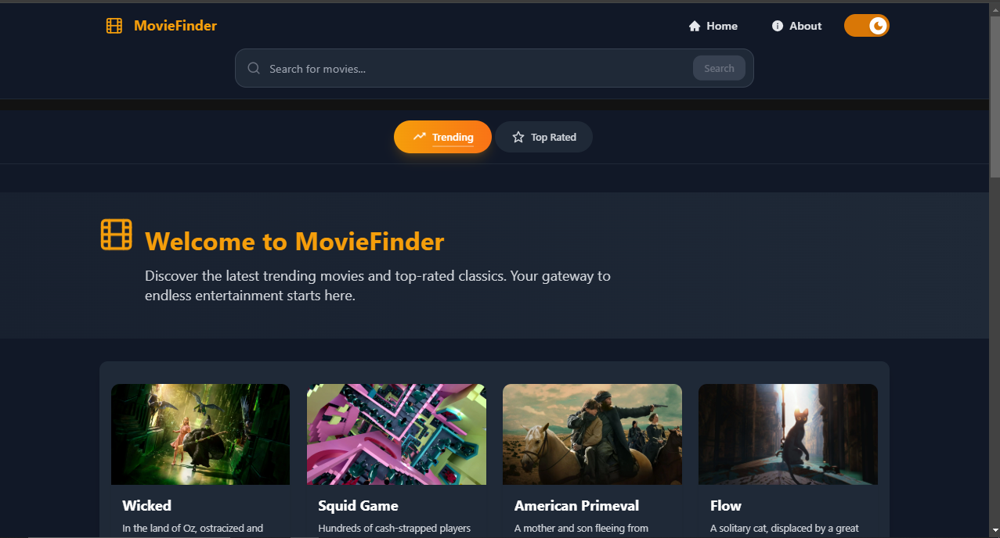
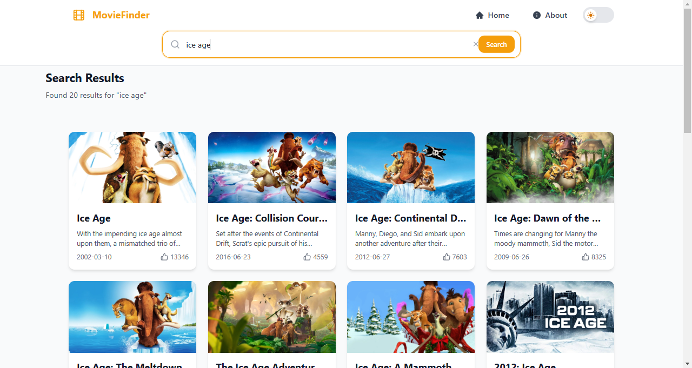

# 🎬 MovieFinder

A modern, feature-rich movie discovery platform built with Next.js 15. Browse trending movies, search your favorites, and explore detailed information about any film in our extensive database.

[](https://moviefinder-demo.vercel.app/)
[](https://nextjs.org/)
[](https://react.dev/)
[](LICENSE)

<div align="center">
  
</div>

## ✨ Features

- 🔍 **Advanced Search**: Find movies by title, genre, or year with real-time search suggestions
- 🎯 **Comprehensive Details**: Access detailed information including cast, reviews, and ratings
- 🎬 **Movie Categories**: Browse trending and top-rated movies
- 🌓 **Theme Customization**: Seamless dark/light mode switching
- 📱 **Responsive Design**: Optimized for all devices and screen sizes
- ⚡ **Performance**: Fast page loads with Next.js app router and server components
- 🎨 **Modern UI**: Sleek interface using HeadlessUI and Tailwind CSS
- 🌐 **SEO Optimized**: Enhanced meta tags and dynamic sitemap generation

<div align="center">
  
</div>

## 🚀 Tech Stack

- **Framework**: [Next.js 15.1.4](https://nextjs.org/)
- **UI Library**: [React 19](https://react.dev/)
- **Styling**: 
  - [Tailwind CSS](https://tailwindcss.com/)
  - [HeadlessUI](https://headlessui.dev/)
- **State Management**: React Context + Hooks
- **Icons**: [React Icons](https://react-icons.github.io/react-icons/)
- **Theme Management**: [Next Themes](https://github.com/pacocoursey/next-themes)
- **Data Fetching**: Server Components + TMDB API

## 📋 Prerequisites

- Node.js 18.0 or higher
- npm or yarn package manager
- TMDB API key

## 🛠️ Installation

1. **Clone the repository**
```bash
git clone https://github.com/lahiruanushka/next-movie-app.git
cd next-movie-app
```

2. **Install dependencies**
```bash
npm install
# or
yarn install
```

3. **Set up environment variables**
Create a `.env.local` file:
```env
# Required
API_KEY=your_tmdb_api_key_here

# Optional
NEXT_PUBLIC_SITE_URL=your_deployment_url
```

4. **Start development server**
```bash
npm run dev
# or
yarn dev
```

Visit [http://localhost:3000](http://localhost:3000) to view the application.

## 📁 Project Structure

```
next-movie-app/
├── app/                      # Next.js app router
│   ├── layout.js            # Root layout
│   ├── page.js              # Home page
│   ├── loading.js           # Loading UI
│   ├── error.js             # Error handling
│   ├── search/              # Search functionality
│   │   └── page.js         
│   └── movie/              # Movie details
│       └── [id]/
│           └── page.js
├── components/              # Reusable components
│   ├── layout/             # Layout components
│   │   ├── Header.js
│   │   └── Footer.js
│   ├── movie/              # Movie-related components
│   │   ├── Card.js
│   │   └── Results.js
│   └── search/             # Search components
│       └── SearchBox.js
├── lib/                    # Utility functions
├── public/                 # Static assets
└── styles/                 # Global styles
```

## 🧩 Key Components

- `SearchBox`: Real-time search with debouncing and suggestions
- `MovieDetails`: Comprehensive movie information display
- `MovieFilterNavigation`: Category-based movie filtering
- `Results`: Responsive movie grid with lazy loading
- `ThemeSwitch`: Dark/light mode toggle

## 🔨 Available Scripts

```bash
# Development with hot reload
npm run dev

# Build for production
npm run build

# Start production server
npm run start

# Run linting
npm run lint

# Run tests
npm run test
```

## 🔑 API Configuration

To set up your TMDB API access:

1. Visit [TMDB API](https://www.themoviedb.org/documentation/api)
2. Create an account and request an API key
3. Add the API key to your `.env.local` file

## 🤝 Contributing

Contributions are welcome! Please follow these steps:

1. Fork the repository
2. Create your feature branch: `git checkout -b feature/amazing-feature`
3. Commit your changes: `git commit -m 'Add amazing feature'`
4. Push to the branch: `git push origin feature/amazing-feature`
5. Open a Pull Request

## 📄 License

This project is licensed under the MIT License - see the [LICENSE](LICENSE) file for details.

## 🙏 Acknowledgments

- [React & Next js Projects with Sahand](https://www.youtube.com/@reactproject) - Original tutorial
- [TMDB](https://www.themoviedb.org/) - Movie data API
- [Vercel](https://vercel.com) - Hosting platform
- [Next.js Team](https://nextjs.org/) - For the amazing framework
- [Tailwind CSS](https://tailwindcss.com/) - For the utility-first CSS
- [HeadlessUI](https://headlessui.dev/) - For accessible components

## 💬 Support

Need help? Here's how you can reach us:

- Open an [issue](https://github.com/lahiruanushka/next-movie-app/issues)
- Email: lahiruanushkaofficial@gmail.com

## 📸 Screenshots

<div align="center">
  
  
</div>