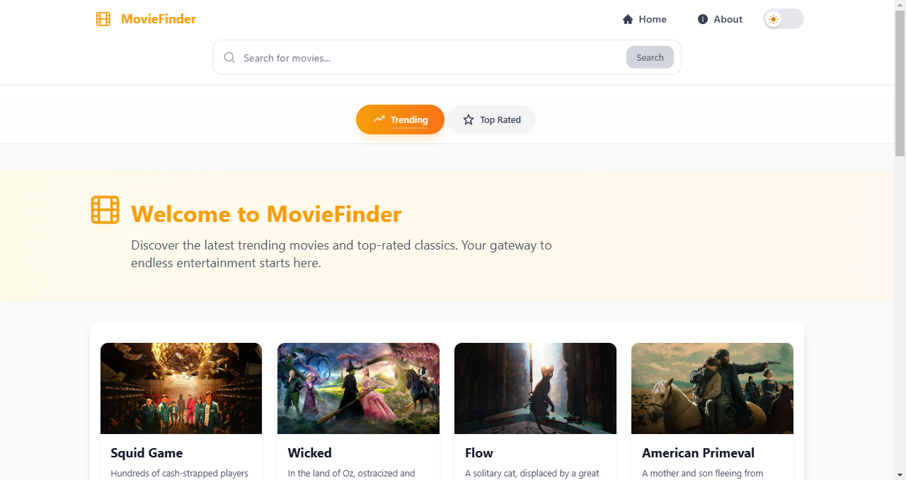

# MovieFinder

MovieFinder is a modern web application built with Next.js that allows users to discover and explore movies. Users can browse trending and top-rated movies, and view detailed information about specific movies.

🌐 **[Live Demo](https://moviefinder-demo.vercel.app/)**



## Tutorial Source

This project was built following the tutorial by **React & Next js Projects with Sahand**:
- 📺 Tutorial Link: [Build a Modern Next.js 13 Application](https://youtu.be/69vpmZgDeN8?si=me37P0gqPSgz08OQ)
- 🎓 Channel: [React & Next js Projects with Sahand](https://www.youtube.com/@reactproject)

## Features

- 🎬 Browse trending and top-rated movies
- 🌓 Dark/Light mode support
- 📱 Fully responsive design
- 🎯 Detailed movie information
- ⚡ Fast page loads with Next.js
- 🎨 Modern UI with HeadlessUI and Tailwind CSS

## Tech Stack

- [Next.js 15.1.4](https://nextjs.org/) - React framework
- [React 19](https://react.dev/) - JavaScript library
- [Tailwind CSS](https://tailwindcss.com/) - CSS framework
- [HeadlessUI](https://headlessui.dev/) - Unstyled UI components
- [React Icons](https://react-icons.github.io/react-icons/) - Icon library
- [Next Themes](https://github.com/pacocoursey/next-themes) - Theme management

## Prerequisites

Before you begin, ensure you have the following installed:

- Node.js (v18 or higher)
- npm or yarn

## Getting Started

1. Clone the repository:

```bash
git clone https://github.com/lahiruanushka/next-movie-app.git
cd next-movie-app
```

2. Install dependencies:

```bash
npm install
# or
yarn install
```

3. Create a `.env.local` file in the root directory and add your TMDB API key:

```env
API_KEY=your_tmdb_api_key_here
```

4. Run the development server:

```bash
npm run dev
# or
yarn dev
```

5. Open [http://localhost:3000](http://localhost:3000) in your browser to see the application.

## Project Structure

```
next-movie-app/
├── app/
│   ├── layout.js
│   ├── page.js
│   ├── loading.js
│   ├── error.js
│   └── movie/
│       └── [id]/
│           └── page.js
├── components/
│   ├── MovieFilterNavigation.js
│   ├── Card.js
│   ├── Results.js
│   └── Footer.js
├── public/
└── styles/
    └── globals.css
```

## Key Components

- `HomePage`: Main page displaying movie grid
- `MovieFilterNavigation`: Navigation bar for filtering movies
- `Card`: Individual movie card component
- `Results`: Grid layout for movie cards
- `Header`: Application header
- `Footer`: Application footer

## Available Scripts

```bash
# Development
npm run dev

# Build
npm run build

# Production
npm run start

# Linting
npm run lint
```

## Environment Variables

The following environment variables are required:

```env
API_KEY=your_tmdb_api_key
```

To obtain an API key:

1. Visit [TMDB API](https://www.themoviedb.org/documentation/api)
2. Create an account and request an API key
3. Copy the API key to your `.env.local` file

## Contributing

1. Fork the repository
2. Create your feature branch (`git checkout -b feature/amazing-feature`)
3. Commit your changes (`git commit -m 'Add some amazing feature'`)
4. Push to the branch (`git push origin feature/amazing-feature`)
5. Open a Pull Request

## License

This project is licensed under the MIT License - see the [LICENSE](LICENSE) file for details.

## Acknowledgments

- [React & Next js Projects with Sahand](https://www.youtube.com/@reactproject) for the excellent tutorial
- [The Movie Database (TMDB)](https://www.themoviedb.org/) for providing the movie data API
- [Next.js Documentation](https://nextjs.org/docs) for the excellent documentation
- [Tailwind CSS](https://tailwindcss.com/) for the utility-first CSS framework
- [HeadlessUI](https://headlessui.dev/) for accessible UI components

## Support

For support, please open an issue in the repository or contact the maintainers.